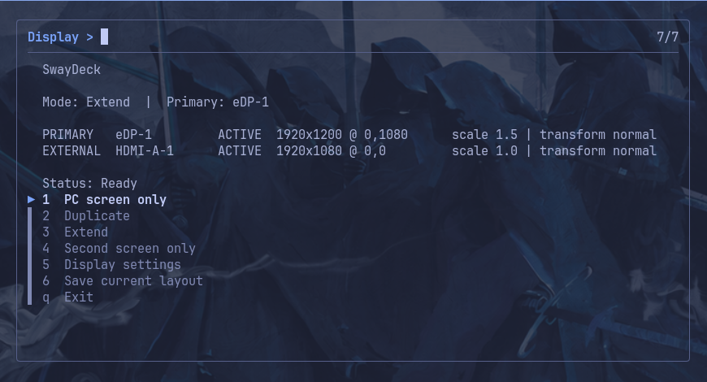

# SwayDeck

**Keyboard-first TUI display manager for Sway.**



SwayDeck provides a compact terminal interface for common multi-monitor
operations without requiring a full graphical display settings application.

## Features

- PC screen only
- Duplicate display via `wl-mirror`
- Extended desktop
- Second screen only
- Right / Left / Above / Below display topology
- Per-display scaling
- Landscape and portrait orientation
- Multi-monitor aware
- Keyboard-first `fzf` interface
- Terminal-native transparent background
- Tokyo Night-inspired foreground palette
- Optional Waybar integration
- Optional `Super+P` binding

## Requirements

### Core

- Sway
- Bash
- `jq`
- `fzf`

### Duplicate mode

- `wl-mirror`

### Optional

- `notify-send`
- Ghostty for the example launcher configuration
- Waybar for the example panel integration
- Font Awesome or a Nerd Font for the example Waybar icon

## Fedora

```bash
sudo dnf install fzf jq wl-mirror
```

## Installation

Clone the repository:

```bash
git clone https://github.com/ocelotnotch/swaydeck.git
cd swaydeck
./install.sh
```

The installer places SwayDeck at:

```text
~/.local/bin/swaydeck
```

When `~/.local/bin/displayctl` is unused, the installer also creates a
compatibility symlink:

```text
~/.local/bin/displayctl -> ~/.local/bin/swaydeck
```

An existing `displayctl` file or unrelated symlink is never overwritten.

Then run:

```bash
swaydeck
```

If `~/.local/bin` is not in your `PATH`, run:

```bash
~/.local/bin/swaydeck
```

The installer does not modify your Sway or Waybar configuration.

## Uninstallation

From the cloned repository:

```bash
./uninstall.sh
```

The uninstaller removes the SwayDeck executable and its compatibility symlink when applicable.

Existing unrelated `displayctl` files or symlinks are never removed.

Sway and Waybar configuration are intentionally left unchanged.

## Keyboard workflow

### Main menu

| Key | Action |
| --- | --- |
| `1` | PC screen only |
| `2` | Duplicate |
| `3` | Extend |
| `4` | Second screen only |
| `5` | Display settings |
| `q` | Exit |

### Extend

Example: place the external display above the primary display.

```text
3 + Enter
a + Enter
3 + Enter
```

Available positions:

| Key | Position |
| --- | --- |
| `1` | Right |
| `2` | Left |
| `3` | Above |
| `4` | Below |

## Display settings

SwayDeck supports per-display:

- scaling from `1.00x` through `3.00x`
- landscape
- portrait
- landscape flipped
- portrait flipped

For a standard two-monitor setup, SwayDeck attempts to preserve the existing
display relationship after scale or orientation changes.

## Waybar

An example Waybar module and CSS are provided under:

```text
examples/
```

The module can launch SwayDeck through Ghostty:

```json
"custom/swaydeck": {
  "format": "\uf108",
  "tooltip": true,
  "tooltip-format": "SwayDeck  •  Super+P",
  "on-click": "ghostty -e ~/.local/bin/swaydeck"
}
```

## Sway binding

Example:

```conf
bindsym $mod+p exec ghostty -e ~/.local/bin/swaydeck
```

## Duplicate mode

Sway does not provide native output mirroring.

SwayDeck therefore uses `wl-mirror` for Duplicate mode. The underlying
outputs remain real Sway outputs while `wl-mirror` presents the primary
display fullscreen on the external output.

## Tested baseline

Initial development and testing:

- Fedora 44
- Sway
- Wayland
- Ghostty
- Waybar

Other distributions may work but are not yet part of the tested baseline.

## Version

Current frozen release:

```text
v0.1.0
```

## License

MIT
